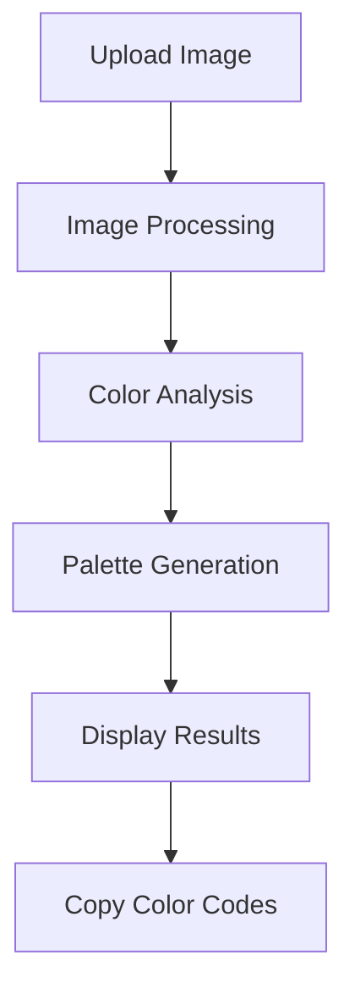
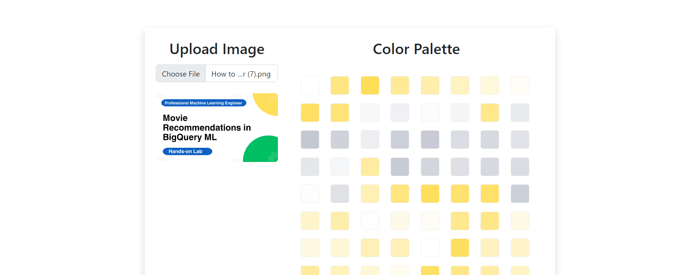

# 🎨 **Image Color Palette Detector** 🖌️

[](https://flask.palletsprojects.com/)
[](https://www.python.org/)
[](https://developer.mozilla.org/en-US/docs/Web/HTML)

## 📋 **Description**

This website is a powerful tool for designers, artists, and anyone who wants to extract the perfect color palettes from images. Key features include:

| ✨ Feature | 📝 Description |
|------------|---------------|
| 🖼️ **Easy Image Upload** | Simply upload any image (JPG, PNG, etc.) using the intuitive interface. |
| 🌈 **Accurate Color Palette Extraction** | Our advanced algorithms carefully analyze your image to identify the dominant and complementary colors, creating a harmonious palette. |

## 🔍 **How It Works**



## 📱 **How to Use**

1. Visit the website.
2. Click the **"Upload Image"** button and select your desired image from your device.
3. The website will process your image and display a beautiful color palette.
4. Click on individual color swatches to copy their color codes in your preferred format.
5. Use your extracted color palette in your web designs, artwork, presentations, or any other creative project!

## 🖼️ **Example**



## 🎯 **Use Cases**

> **For Designers:** Extract precise color codes from inspiration images for consistent branding

> **For Artists:** Discover complementary colors and create harmonious compositions

> **For Developers:** Implement cohesive color schemes in your web and app projects

> **For Marketers:** Ensure brand color consistency across all visual assets

## 🚀 **Future Development**

| 💡 Feature | 📝 Description | 🔄 Status |
|-----------|----------------|-----------|
| 📤 **Social Sharing** | Allow users to easily share their generated palettes. | Planned |
| 📚 **Palette Library** | Save and revisit previously generated palettes. | In Progress |
| 🔍 **Color Palette Search** | Implement a search function to find palettes based on keywords or color themes. | Planned |

## 🔧 **Technology Stack**

- **Frontend:** HTML, CSS, JavaScript
- **Backend:** Flask (Python)
- **Hosting:** Cloud-based service
- **Image Processing:** Python libraries

## ⚡ **Quick Start**

```bash
# Clone the repository
git clone https://github.com/Yash-Kavaiya/image-color-detection.git

# Navigate to the project directory
cd image-color-detection

# Install dependencies
pip install -r requirements.txt

# Run the application
python main.py
```

## 📲 **Contact**

If you have any questions, suggestions, or would like to contribute to this project, please reach out to me.

## 📄 **License**

This project is licensed under the MIT License - see the [LICENSE](LICENSE) file for details.

---

<div align="center">
  <p>✨ <b>Let your creativity shine with the Image Color Palette Generator!</b> 🎨</p>
</div>
